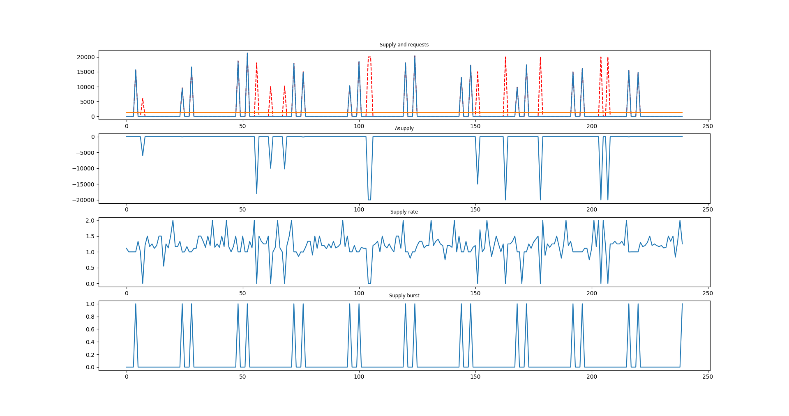
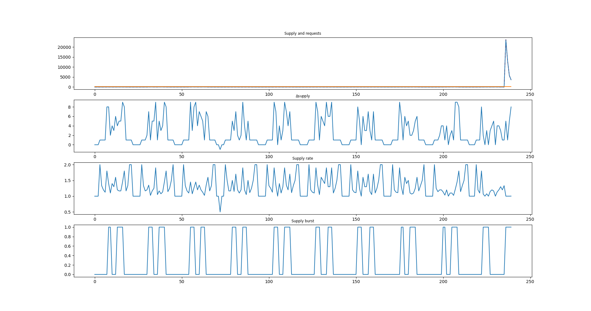

# 第二题相关数据

## 基尼系数
基尼系数用于衡量该企业是否为“爆发型企业”，因为其衡量的是企业供货量的不均等情况。
基尼系数的计算方法：对企业240周的供货量从小到大进行排序，并且画出累计分布图。连接累计分布图的起始端和终止端，空缺的面积占三角形的面积的比例为基尼系数。（缺少数学公式，待补充）
如图所示：

蓝线为累计供货量图，红线为直接连接起止端的线，其包围的封闭图形面积就是基尼系数。

基尼系数越大，越说明该企业供货分配不平等，越能说明该企业是爆发型企业。

## 筛选优质爆发型企业
这样的企业应该满足这样的性质：
1. 基尼系数较大
2. 供货率较大
3. 供货量较大
4. 长期供货率较大

(供货率与长期供货率的区别？)

我们按照公式
$$ score = 基尼系数 * ln(供货率) * 供货量 * 长期供货量 $$
对企业进行打分，越高分就越满足优质爆发型企业的要求，筛选出来的前5名如下：
|编号|基尼系数|
|-|-|
|S140|0.92|
|S139|0.91|
|S374|0.95|
|S307|0.95|
|S338|0.91|

他们的图像如下（按顺序）：

