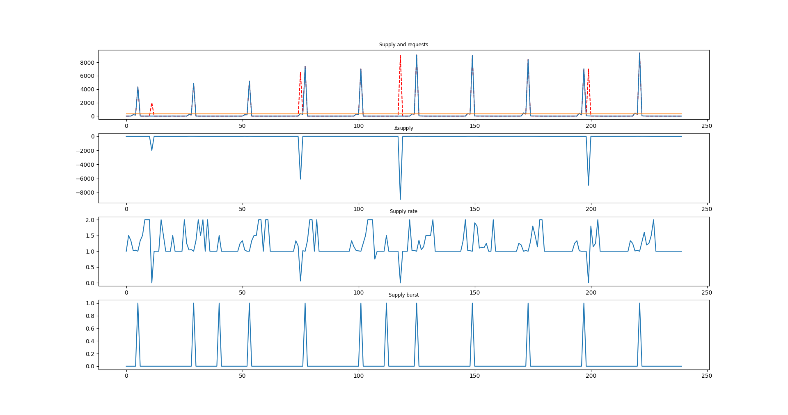
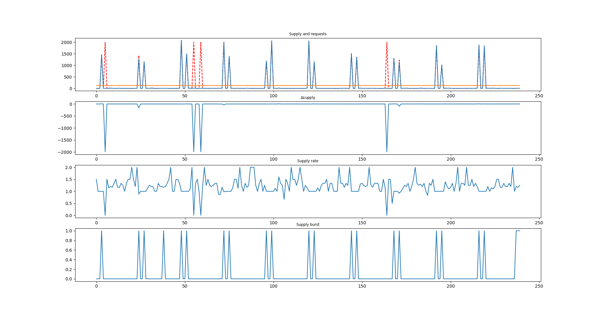

# 解决方案概述

---
[TOC]

---
## 评价供应商
### 供货商产能
这里用的是供货商过去240周供货量的均值来表示。
### 供货商的信用
这里用的是下述四个参数来表示：
1. **当周履约率**：这一周的供应量/订单量
2. **当周履约率期望**：该供应商240周的**当周履约率**均值
3. **长期履约率**：总供应量/总订单量
4. **当周履约率方差**：该供应商240周的**当周履约率**方差

**为什么要区分当周履约率期望和长期履约率？** 考虑一种情况，我每周向一个供应商订购1单位原料，每周都能供应上，而有一周我向他订购了2000单位原料，供应不上，这样：  

**当周履约率期望**不会发生太大变化，而**长期履约率**会显著变小。因此当周履约率期望可以用来衡量该供应商是否**几乎每次都履约**，而**长期履约率**还可以衡量该供应商**对大订单的响应能力**。

### 供应商过去合作的愉快程度
这里就用过去240周中有多少周给该公司下订单来表示，如果几乎每一周都有订单，我们认为合作是相当愉快的。

### 供应商的分类
我们把供应商分类为**爆发型供应商**和**持续型供应商**，后续题目中会对这两种供应商单独讨论，这里给出分类的依据。

**基尼系数**，指的是对该供应商的两周之间供货量差距的期望与供货量均值的两倍的比值，即，若$f(x)$代表在第$x$周的供货量，那么该供货商的基尼系数为：
$$ Gini = \frac{E|x_1 - x_2|}{2\bar{f}(x)}, \forall x_1, x_2\in[1, 240]\cap\mathbb{Z} $$
基尼系数的数学意义是供货量扎堆出现在某几周的严重程度，基尼系数越大，代表这个供应商越有可能是爆发型企业。为了说明这种分类方法是正确的，下文我们用该系数找到了一些有代表性的爆发型企业。

#### 筛选优质爆发型企业
这样的企业应该满足这样的性质：
1. 基尼系数较大
2. 供货率较大
3. 供货量较大
4. 长期供货率较大

(供货率与长期供货率的区别？)

我们按照公式
$$ score = 基尼系数 * ln(供货率) * 供货量 * 长期供货量 $$
对企业进行打分，越高分就越满足优质爆发型企业的要求，筛选出来的前5名如下：
|编号|基尼系数|
|-|-|
|S140|0.92|
|S139|0.91|
|S374|0.95|
|S307|0.95|
|S338|0.91|

他们的图像如下（按顺序）：

## 评价转运商
转运商的评价和下述三个值有关：
1. 合作次数
2. 损坏率均值
3. 损坏率方差

## 问题解决
### 第一题
对供应商进行综合评价，就是对供应商的特征进行打分，我们定义供应商的分数为：
$$ score = 实际供应量均值^2 * \exp(每周履约率均值) * (2-每周履约率方差) * 活跃周数/240 $$
这个分数代表，对供应商的评价和供应商的产能、信用、以及过往合作情况相关。其中最重要的因素是产能。

对供应商的分数进行排序，选出前10名供应商，如下：
|供应商编号|活跃天数|产品类型|供货量均值|履约率均值|履约率方差|得分|
|-|-|-|-|-|-|-|
|S229|240|A|1478.695833|0.994426|0.004678|11793547.571959|
|S361|240|C|1367.000000|0.992054|0.005355|10051851.565735|
|S140|220|B|1258.529167|1.199825|0.153272|8900580.531450|
|S108|240|B|1003.958333|0.984083|0.016976|5347381.707258|
|S151|240|C|810.408333|0.983328|0.019980|3476414.044851|
|S340|240|B|714.275000|0.999294|0.001881|2769108.076755|
|S282|240|A|705.583333|1.013309|0.004354|2736871.865705|
|S139|224|B|632.758333|1.243991|0.083340|2484940.150740|
|S275|240|A|660.637500|1.003393|0.000305|2380444.709616|
|S329|240|A|652.158333|1.001920|0.000535|2316050.659905|

从结果上看，我们的评价标准还是相当合理的，由此可以选出最佳前50供应商，详细数据参见[Q1.md]()

### 第二题
#### 至少需要多少家供应商才能保证生产
对于每一周，依次选取前问题1中**排名前列**的供应商进行供应，先选择稳定型供应商（基尼系数小于0.5），再选择爆发型供应商（基尼系数大于0.5），直到该周满足下列条件之一：
1. 本周转运商的运力达到上限。
2. 仓库中的原材料足够支撑当周生产以及后两周生产。

如何确定排名前列的临界？使用二分查找法，将供应商列表的选择范围确定在1-n之间，最终得到只需要前36家供应商就可以保证正常生产。

下表表示仅使用前36家供应商，对未来24周进行供货安排：

当周进货量可支撑的产能 当周进货量
70961.36216329968 47742   
85913.25462962965 28895   
90494.59154040404 22456   
103299.2617845118 29379   
85468.35164141416 7208   
77281.35521885523 14112   
69094.35879629628 14112   
60907.36237373736 14112   
52720.365951178435 14112   
44533.369528619514 14112   
49114.70643939394 22456   
69161.19486531986 32663   
60974.19844276094 14112   
52787.20202020202 14112   
44668.261153198655 14161   
36549.3202861953 14161   
28430.379419191944 14161   
41303.10521885525 29428   
54175.831018518555 29428   
85816.23358585863 40852   
85126.45938552191 19510   
97205.01851851853 27854   
85291.64867424245 11553   
92569.80376683503 24319   

#### 转运商分配的方案
##### 转运商的评价体系
按转运商的损坏率进行排序
##### 分配方案
按照**排序原理**，损坏率最低的转运商去运最贵的A原材料。

### 第三题
本题要考虑转运和仓储成本，因此要多运送A，少运送C，于是修改供应商的评价标准重新排序供应商，评分函数应该加入转运和储存成本，因此新的评价函数为：
$$ score' = score * (1 / 每立方米原材料能支撑的产能 * 产品价格 - 原材料价格 - 储存价格 - 转运价格) $$
该分数表示理想状态下选择该供应商所产生的利润，用这个分数对供应商进行排序，并且用第二题的方法重新选取供应商，得到新的订购方案。

### 第四题
要想知道最高的产能，只要修改第二题的选取方案即可：

对于每一周，依次选取**全部供应商**进行供货，先选择稳定型供应商（基尼系数小于0.5），再选择爆发型供应商（基尼系数大于0.5），直到该周满足下列条件之一：
1. 本周转运商的运力达到上限。
2. 所有供应商选取完毕。

查找选取结束后的每周产能，可发现技术改造可以把产能提高到每周生产3.17万立方米产品。